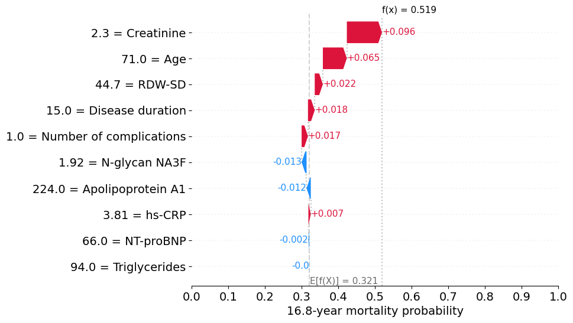

# XAI-T2DM-mortality-prediction

This repository contains the XAI model for predicting the 16.8-year risk (probability) of death in patients with T2DM based on ten variables:
- Age, years
- Number of complications (0, 1, 2, 3, 4 or 5), where complications are diabetic neuropathy, diabetic nephropathy, diabetic retinopathy, atherosclerotic vascular disease and major adverse cardiovascular events (MACE)
- NT-proBNP (N-terminal prohormone of brain natriuretic peptide), ng/L
- Triglycerides, mg/dL
- Creatinine, mg/dL
- hs-CRP (high-sensitivity C-reactive protein), mg/L
- RDW-SD (red cell distribution width-standard deviation), fL
- Apolipoprotein A1, mg/dL
- N-glycan NA3F (branching α-1,3-fucosylated triantennary glycan), %
- Disease duration (duration of T2DM), years


## Getting Started

### File structure
```
├── data                          <- Folder containing data files
│   └── data.xlsx                     <- Data file example
│
├── image                         <- Folder containing an example explainability plot
│
├── model                         <- Folder containing trained prediction model
│
├── results                       <- Results folder (will appear after running the model)
│
├── src                           <- Folder containing source code
│   └── t2dm_model.py                 <- Module for working with model, data and graphs
│
├── requirements.txt              <- File for installing python dependencies
│
├── run_prediction.py             <- Script to run the model
│
└── README.md                     <- This file
```

### Requirements
Python 3.11  
openpyxl  
pandas  
numpy  
matplotlib  
scikit-survival==0.23.0  
shap==0.46.0  

### Installing
```bash
# clone project
git clone https://github.com/VershininaOlga/XAI-T2DM-mortality-prediction
cd XAI-T2DM-mortality-prediction

# [OPTIONAL] create environment
python -m venv .t2dm
.t2dm\Scripts\activate

# install requirements
pip install -r requirements.txt
```

### Data preparation
You need to prepare a data .xlsx file containing the following columns: Patient ID (unique patient identifier), Age, Number of complications, NT-proBNP, Triglycerides, Creatinine, hs-CRP, RDW-SD, Apolipoprotein A1, N-glycan NA3F and Disease duration.  
The file with your data should be placed in the ```data``` folder.  
An example data file can be found in ```data/data.xlsx```.  
Please note that the data should not contain missing values ​​(all samples with missing values ​​will be removed from consideration).

### Running the prediction model
To run the model:
```
python run_prediction.py --file_name <file_name>
```
where ```<file_name>``` - data file name, eg ```data.xlsx```

Please note that plotting explainability graphs for a large dataset can take a significant amount of time.

As a result of running the script, a ```results``` folder will be generated, which will contain  
- file with a table containing the predicted mortality probability of patients from data file
- subfolder ```local_expl``` containing local explainability plots of the model's predictions for each patient


### Interpretation of explainability plots

The y-axis displays the variables (features) from bottom to top in ascending order based on their contribution to the prediction. The x-axis shows the 16.8-year mortality probability. The bottom of the graph shows the base probability of the model, E[f(X)], from which the prediction begins. Each band of the graph shows how much and in which direction the value of the feature changes the prediction. Blue bands correspond to features whose values ​​decrease the probability of mortality, and red bands correspond to features whose values ​​increase the probability of mortality. The predicted probability of 16.8-year mortality is reflected in f(x).


## Citation
Olga Vershinina, Jacopo Sabbatinelli, Anna Rita Bonfigli, Dalila Colombaretti, Angelica Giuliani, Mikhail Krivonosov, Arseniy Trukhanov, Claudio Franceschi, Mikhail Ivanchenko, Fabiola Olivieri. Explainable artificial intelligence model predicting the risk of all-cause mortality in patients with type 2 diabetes mellitus, 2025.
